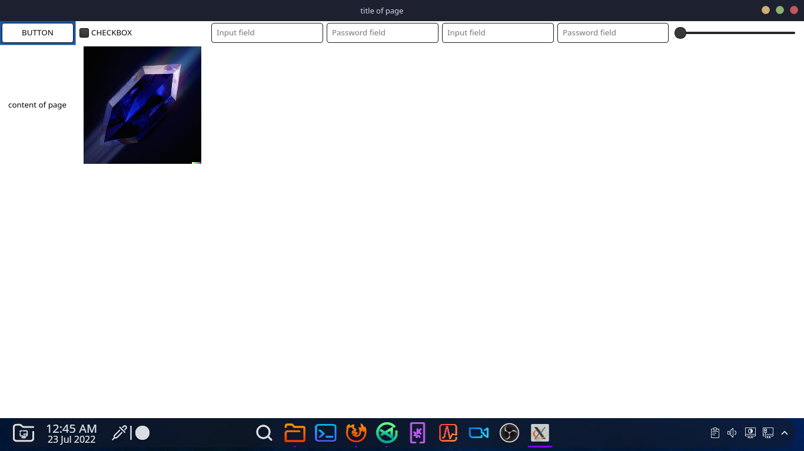

# Tanzanite 

It is designed to a fast,simple and safe alternative to the https protocol,that is currently in devolopment

# Current progress
 
It can parse tml and tss and render a bit of it

# Screenshot

# Build and run it

- ``./build.sh``

- ``./a.out``